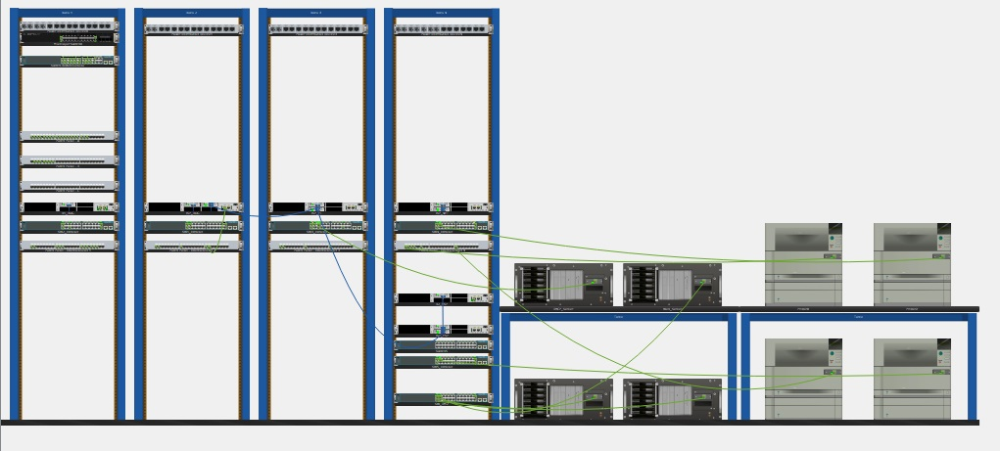
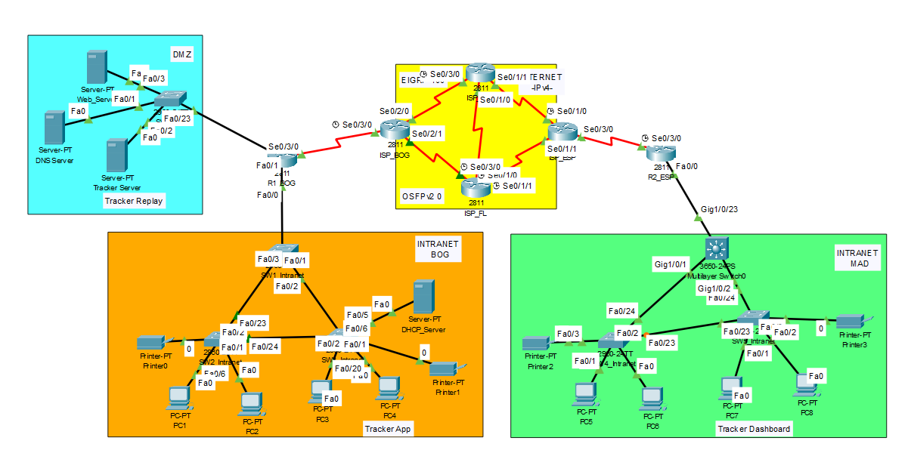
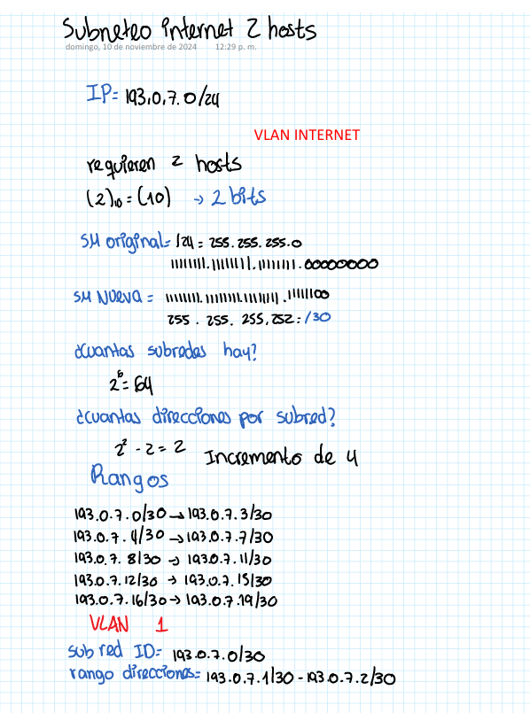
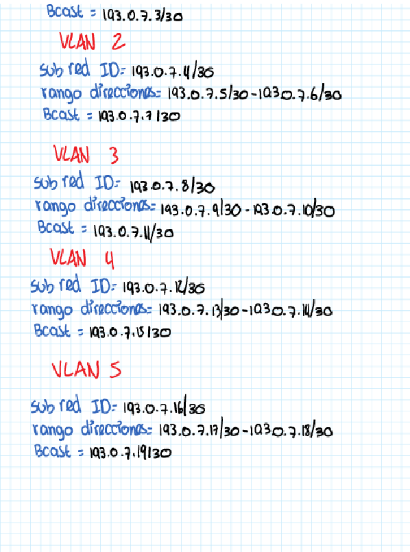

# DocumentacionLab3

## Miembros: Tomas Barrios Guevara, Valentina Ruiz Torres y Darek Aljuri Martínez

Hicimos uso de DHCP stafeful debido a que lo consideramos la mejor opcion entre los metodos de asignación de ipv6. SLAAC solo no podia ser utilizado debido a que a los computadores no se les podia poner servidor DNS, requerido para el acceso a la aplicacion y a su respectiva pagina. Stateless DHCP era una buena opcion debido que aunque los dispositivos finales autogeneraran su direccion IPV6 con SLAAC, pero podian obtener información extra como la dirección del servidor DNS mediante un servidor de DHCP, aunque el servidor de DHCP no administraria las direcciones. Preferimos DHCP Stateful debido a que se tiene un mayor control frente la asignación de las direcciones IPS, asi como un servidor que centraliza todos los registros de los dispositivos conectados a la red.

Manejamos el servidor DHCP stateful en la intranet de bog dentro del router. Durante el desarrollo del laboratorio intentamos que el end device que es un servidor con el proposito de ser usado como servidor de DCHP, fuera utilizado con este proposito, pero tras muchos intentos no se logro la comunicación entre el router y el servidor, debido a que el comando que intentabamos utilizar que era "ipv6 dhcp relay destination <Dirección del servidor dhcp>" no lo soportaba packet tracer, se intento usar el comando de "ipv6 dhcp server <Nombre del pool de dhcp>" poniendo el nombre que se le habia asignado al pool para esa VLAN dentro del servidor de DHCP pero no lograbamos la comunicación debido a que en ningun momento se le pudo decir al router cual era la dirección del servidor del cual tenia que sacar las direcciones IPV6 para cada VLAN, que fue lo que buscabamos hacer con el comando que no soportaba packet tracer. Aun asi dejamos configuradas las pools dentro del servidor de DHCPv6, en el apartado de services. Luego notamos que la configuración si funcionaba pero el servidor solo proveia las direcciones con rango del cual se seleccionara el DHCPPool, teniendo el problema que solo se puede seleccionar una pool a la vez, generando un conflicto para que todas las VLANS tuviera su rango de direcciones correspondientes, podiamos tener las VLANS configuradas a la perfección pero si en el DHCPv6 teniamos la pool del VLAN10 seleccionaba, daba las direcciones unicamente de dicha pool. Por estas razones tomamos la decisión de dejar al router como el proovedor de direcciones de DHCP mediante DHCP stateful, ya que en el router tambien se trabaja la segmentación de las VLANS. Creamos las pools de DHCPv6 dentro del router para cada VLAN y le configuramos la flag de DHCP stateful para que los end devices que pertenecieran a esa VLAN supieran que iban a recibir toda su información de red por parte del router. Con esto logramos que todas las VLANS tuvieran la asignacion de direcciones IPV6 exitosas.

Manejamos el servidor DHCP stateful en la intranet de mad dentro del router. Se siguio una configuración similar a la realizada en el router de bog, pero cambiando el prefijo de direcciónes de red al que le correspondia dentro de la red de mad. Consideramos una mejor opcion hacerlo en el router y no en el multilayer switch debido a que le estariamos poniendo mas labores al MLS dandole el trabajo de asignar las redes a las distintas vlans dentro de la red y consideramos mejor que el MLS se encargara unicamente de la comunicación inter vlan. Aunque dentro del MLS tuvimos que ponerle unas configuraciones extras mencionadas mas adelante para que pudiera hacer la comunicación inter vlan correctamente y que ademas de esto permitiera correctamente la asignacion de las direcciones ipv6.

## 1. Introducción
En este laboratorio, se busca reforzar los conocimientos fundamentales sobre redes mediante la implementación de una topología empresarial utilizando Cisco Packet Tracer. Se trabajará con tecnologías LAN y WAN, combinando IPv4 e IPv6 en un entorno dual stack para garantizar la compatibilidad y migración eficiente entre ambos protocolos. Además, se configurarán servicios esenciales como DHCP, DNS y VPN IPsec, asegurando una conexión segura entre las intranets de diferentes ubicaciones.

Se establecerán políticas de acceso mediante listas de control de acceso (ACL) para regular la comunicación en función de protocolos HTTP y HTTPS, y se configurarán VLANs con protocolos de enrutamiento como OSPF o EIGRP para la gestión del tráfico intra e inter VLANs. También se desarrollará e integrará una aplicación de seguimiento remoto de activos mediante sockets, que permitirá monitorizar el rendimiento de los dispositivos en tiempo real. Finalmente, se documentarán las configuraciones realizadas, se evaluará el flujo de datos generado por las aplicaciones de seguimiento, y se garantizará la correcta gestión de red mediante SNMP.

## 2. Topología de red

Esta topología segmenta una empresa multinacional en dos grandes sedes (Bogotá y Madrid), donde las redes LAN están organizadas por VLANs y conectadas mediante una WAN que emplea protocolos de enrutamiento dinámico. La DMZ asegura el acceso seguro a servidores públicos, y la dualidad IPv4/IPv6 permite interoperabilidad y modernización en la infraestructura.

El cableado estructurado fue realizado en base a la plantilla de cableado que el docente sugirió guardar del segundo laboratorio. Los dispositivos adicionales agregados en este laboratorio se ubicaron en el último rack, y aquellos que no podían montarse en el rack, como las impresoras y los servidores, se colocaron en una mesa al lado del último rack.

### Zona Azul - DMZ (Zona Desmilitarizada):
Aloja servicios públicos expuestos al internet. Esta zona permite el acceso desde el exterior sin comprometer las redes internas.
  * Elementos:
    * Servidor Web: Server-PT (Web_Server): Según la página oficial de Hubspot "Un servidor web es una plataforma computacional que resguarda datos para ser consultados por diversos usuarios. Cuenta con un software que entrega la información solicitada por visitantes o miembros de un grupo de trabajo, a través de un dispositivo conectado a la red." [1].
  
    * Servidor DNS: Server-PT (DNS Server): "Un servidor DNS responde a las siglas Domain Name System, y nos permite relacionar una dirección escrita, a una dirección IP ." [2]. Dependiendo del registro que tengamos configurado y el software que soporte a dicha configuración.
  
    * Servidor Tracker: Server-PT (Tracker Server): Controla y registra eventos o datos específicos
    * Servidor DHCP: Asigna automáticamente direcciones IP a dispositivos dentro de la red. "Su función principal es simplificar la administración de direcciones IP, evitando conflictos y garantizando una conexión eficiente y ordenada."[3]
    * Switch 2960-24TT: SW_DMZ: Sirve para la interconexión de los servidores, segun la pagina oficial de cisco "es uno de los switches Cisco Catalyst de la serie 2960, que admiten voz, video, datos y acceso altamente seguro."[4].
  * Conexiones: Esta zona conecta con el Router R1_BOG para recibir y enviar solicitudes desde internet.

### Zona Amarilla - WAN (Red de Conexión ISP)

Conecta múltiples sedes a través de enlaces de internet y asegura la comunicación entre los routers usando algun protoolo de enrutamiento .
* Elementos:
  * Routers 2811:
    * ISP_NET (Core de los ISP)
    * R1_BOG (Router de la sede Bogotá)
    * R2_ESP (Router de la sede en España)
   
  * Los routers guían y dirigen los datos de red mediante paquetes que contienen varios tipos de datos, como archivos, comunicaciones y transmisiones simples como interacciones web.En este caso se usa el  2811 que "es un router de la serie 2800 de Cisco, diseñado principalmente para pequeñas y medianas empresas. Ofrece una combinación de funcionalidades de red y seguridad" [5]
* Espacio de Direcciones IPv4: 193.0.7.0/24

### Zona Naranja - Intranet Bogotá (BOG)

Segmenta la red local de la sede de Bogotá en varias VLANs para separar a los usuarios según su función.
* VLANs:
  * 10: VLAN Guest (PC1 - PC3) ---> Guest
  * 20: VLAN Internal (PC2 - PC4) ----> Internal
  * 30: VLAN Server/Printer----> servicio
  * 40: VLAN native ----> nativo
* Elementos:
  * Switches 2960 (SW1_Intranet, SW3_Intranet): Según la página oficial de Cisco los Switches Cisco Catalyst 2960-24TT forman parte de la serie Cisco Catalyst 2960. Esta serie es una familia de switches de capa 2 diseñados para implementaciones en redes de pequeñas y medianas empresas, además cuentan con "24 y 48 puertos de conectividad Gigabit Ethernet (GbE) de escritorio 10/100/1000 " [6].
  
  * Servidor DHCP para asignación dinámica de IPs
  * Impresoras: Printer0 y Printer1
  * Aplicación Tracker instalada en los PCs conectados

* Conexiones: Usa IPv6 en el espacio 2001:1200:A1X::/48

### Zona Verde - Intranet Madrid (MAD)
Implementa la red local de la sede Madrid con VLANs similares a las de Bogotá, pero para diferentes departamentos y funciones.
* VLANs:
  * 10: VLAN Guest (PC5 - PC8) ---> GuestMad 
  * 20: VLAN Internal (PC6-PC7) --->  InternalMad 
  * 30: VLAN Server/Printer ---> serviciosMad
  * 99: VLAN native ---> NativeMad
* Elementos:
  * Switch 2960 y 3560 (multicapa para el enrutamiento local), "Los switches compactos Cisco Catalyst 3560-CX y 2960-CX Series ayudan a optimizar las implementaciones de red. Estos conmutadores administrados Gigabit Ethernet (GbE) y Multigigabit Ethernet (mGig) son ideales para conectividad de datos de alta velocidad" [7]. En esta topologia permite la conexión y el enrutamiento entre VLANs en la sede de Madrid.
  * Impresoras: Printer2 y Printer3
  * PCs con el Dashboard del Tracker
* Conexiones: Espacio IPv6 2001:1200:B2X::/48

## 3. Síntesis de la metodología y resultados de configuración: 
* **Montaje de la topología:**
  
Utilizando el cableado estructurado y los modelos de dispositivos indicados, se recreó la topología de red en Cisco Packet Tracer siguiendo la configuración establecida. En esta red, se utilizaron routers Cisco 2811 en todas las interconexiones principales y en la red WAN del ISP. Cada router está conectado entre sí para simular la interconexión WAN y permitir la conectividad entre las distintas sedes, haciendo uso de los protocolos de enrutamiento EIGRP y OSPF. Los routers se configuraron para manejar direcciones IPv4 e IPv6, asignando espacios de red como **193.0.7.0/24** para Internet y **2001:1200::/48** para enlaces internos y loopbacks.

Para gestionar el tráfico dentro de cada sede, se emplearon switches Cisco 2960 como elementos de acceso. En la sede de Madrid (MAD), se implementó un switch Multilayer 3650 como dispositivo de capa 3, encargado de realizar el enrutamiento entre VLANs locales para optimizar el tráfico y mejorar el rendimiento interno. Se configuraron múltiples VLANs en cada sede, asignando diferentes roles a los dispositivos finales, como VLAN de invitados, internos, servidores e impresoras.

En la zona DMZ, se instalaron servidores esenciales (DNS, web y tracker) para brindar servicios accesibles desde las sedes internas y desde Internet, aislando estos servicios críticos del tráfico de la intranet para mayor seguridad. El servidor DHCP se configuró para proporcionar direcciones IP automáticamente a los dispositivos de la red, mientras que los servidores web y DNS facilitan el acceso a recursos tanto internos como externos.

La topología diseñada asegura una segmentación lógica eficiente mediante VLANs, conectividad global a través de la WAN y servicios críticos disponibles en la DMZ. El uso del switch Multilayer 3650 en Madrid permite además una gestión avanzada del tráfico entre las diferentes VLANs y mejora la eficiencia del enrutamiento en la red interna.

* **Esquema de direccionamiento:**
Se diseñó un esquema de direccionamiento basado en los requerimientos de las VLAN, asignando rangos de direcciones según la cantidad de dispositivos. Se realizó el Subneteo y se construyó una tabla de direccionamiento para toda la topología
  * *ipv4*

    | |  |
    |:----------------------------------------------:|:---------------------------------------------------------:|

  * *ipv6*

  Se llevó a cabo un proceso de subneteo en dos ciudades: Bogotá y Madrid. Ambas ubicaciones contaban con una red inicial de prefijo /48 y el objetivo era dividirlas en subredes de prefijo /64 para poder implementar 4 VLANs en cada ciudad.

     ***Proceso de Subneteo en Madrid***
  
     Red inicial: 2001:1200:B27::/48
  
     Objetivo: Subnetear a /64 para generar 4 VLANs.
  
     El prefijo /48 permite utilizar 16 bits adicionales para subredes, lo que proporciona hasta 65,536 posibles subredes /64. En este caso, se generaron las primeras 4 subredes, asignando cada una a una VLAN específica:

             VLAN 1: 2001:1200:B27:0001::/64
             VLAN 2: 2001:1200:B27:0002::/64
             VLAN 3: 2001:1200:B27:0003::/64
             VLAN 4: 2001:1200:B27:0004::/64

    ***Proceso de Subneteo en Bogotá***
    Red inicial: 2001:1200:A17::/48
  
    Objetivo: Dividir la red en subredes /64 para implementar 4 VLANs.
  
    Siguiendo el mismo método, el se crearon 4 subredes a partir del prefijo /48, asignando una a cada VLAN en Bogotá:
  
            VLAN 1: 2001:1200:A17:0001::/64
            VLAN 2: 2001:1200:A17:0002::/64
            VLAN 3: 2001:1200:A17:0003::/64
            VLAN 4: 2001:1200:A17:0004::/64
  
   ***Resumen del Subneteo en Bogotá y Madrid***
   En ambas redes, se empleó un esquema de subneteo consistente y eficiente, segmentando de /48 a /64 para las VLANs. Esto permitió una organización clara y estructura de direccionamiento sin conflictos, con cada VLAN en una subred /64 distinta en ambas ciudades.

  
* **Asignacion y Verificacion de IPV4-IPV6:**
  ¿Qué método(s) de asignación se debe(n) configurar? ¿En qué terminales se deben configurar los 
servicios requeridos?

* **Configuracion routers:**
Se configuraron los routers Cisco 2811 para soportar el enrutamiento estático y dinámico mediante ***OSPF y EIGRP***, permitiendo la interconexión eficiente de las redes de las sedes y la DMZ. Además, se habilitaron direcciones IPv6 en cada router, tanto en las interfaces internas como en las WANs.

* **Configuracion Switches 2960:**
Los switches de acceso Cisco 2960 se configuraron para soportar VLANs y permitir la conectividad dentro de cada sede. Se definieron las VLANs para separar el tráfico según los roles (invitados, internos, servidores). Además, se habilitó trunking en los puertos hacia los routers para permitir la propagación de las VLANs hacia otras sedes.

* **Configuracion  Multilayer Switch (MLSW) 3650 :**
El switch Multilayer 3650 en Madrid se configuró como dispositivo de capa 3 para gestionar el enrutamiento entre VLANs locales, lo que optimiza el tráfico dentro de la sede. Se habilitó Inter-VLAN routing en este dispositivo, y se configuraron las interfaces SVI para cada VLAN interna.

                  ! Configuración de VLANs
                                    vlan 10
                                      name GuestMad
                                    vlan 20
                                      name InternalMad
                                    vlan 30
                                      name ServiciosMad
                                    vlan 99
                                      name nativeMad
                   
                   ! Configuración del Trunk en el puerto hacia el router
                   interface Ga (varia del switch)
                     switchport mode trunk
                     switchport trunk native vlan 99
                     switchport trunk allowed vlan 10,20,30

     
                  ! Configuracion para la comunicación inter vlan
                  interface Vlan10
                   ipv6 address 2001:1200:B27:1::1/64
                   ipv6 nd managed-config-flag
   
                  
                  interface Vlan20
                   ipv6 address 2001:1200:B27:2::1/64
                   ipv6 nd managed-config-flag
   
                  
                  interface Vlan30
                   ipv6 address 2001:1200:B27:3::1/64
                   ipv6 nd managed-config-flag
                  
                  interface Vlan99
                   ipv6 address 2001:1200:B27:4::1/64
                   ipv6 nd managed-config-flag

* **Configuración de VLANs y Enlace Trunk (802.1Q)**
Debido a la segmentación entre VLANs, es necesario configurar los trunks en los switches para permitir que las VLANs se comuniquen entre sí y con los routers.

 * Configuración en los switches (Bogotá)
   
                 ! Configuración de VLANs
                 vlan 10
                   name Guest
                 vlan 20
                   name Internal
                 vlan 30
                   name Servicio
                 vlan 40
                   name Native

                 ! Configuración de las interfaces a los end devices
                               interface Fa (varia del switch)
                                 switchport access vlan xx (Numero de la VLAN varia de acuerdo a cual end device va la interface y a que Vlan pertenece)
                 
                 ! Configuración del Trunk en el puerto hacia el router
                 interface Fa (varia del switch)
                   switchport mode trunk
                   switchport trunk native vlan 40
                   switchport trunk allowed vlan 10,20,30
   

   

 * En los dos switches (Madrid)
   
                   ! Configuración de VLANs
                   vlan 10
                     name GuestMad
                   vlan 20
                     name InternalMad
                   vlan 30
                     name ServiciosMad
                   vlan 99
                     name nativeMad
                   
                   ! Configuración del Trunk en el puerto hacia el router
                   interface fa (varia del switch)
                     switchport mode trunk
                     switchport trunk native vlan 99
                     switchport trunk allowed vlan 10,20,30

                   
* **Filtros de paquetes y listas de control de acceso (ACLs):**
  * ***Requerimientos de filtrado de tráfico:***
      * Intranet Bogotá (BOG):
        * Los usuarios internos solo pueden acceder al servidor web mediante HTTPs (puerto 443).
        * Usuarios invitados acceden a la web mediante HTTP (puerto 80), no se les permite usar HTTPs.
      * Intranet Madrid (MAD):
        * Los usuarios internos acceden solo mediante HTTPs (puerto 443).
        * Usuarios invitados solo tienen acceso por HTTP (puerto 80), con el acceso a HTTPs (puerto 443) restringido.
      * Zona DMZ:
        * El servidor web estará disponible en la DMZ y gestionado por un servidor DNS.
        * El nombre de dominio para la página web personalizada tendrá el formato (dvt.net)
         
  * ***Implementación de ACLs (Listas de Control de Acceso):***
  "Una ACL es una serie de comandos del IOS que controlan si un router reenvía o descarta paquetes según la información   que se encuentra en el encabezado del paquete. Las ACL son una de las características del software IOS de Cisco más utilizadas." [8]. Las ACLs se aplicarán en los routers de las sedes y la DMZ para garantizar que el tráfico se filtre de acuerdo con las reglas definidas.
    * Ubicación de las ACLs:
      * En el router de salida de Bogotá (BOG):
        Configurar una ACL que permita:
          * HTTPS (puerto 443) solo para usuarios internos de la VLAN.
          * HTTP (puerto 80) solo para usuarios invitados.
      * En el router de Madrid (MAD):
      Configurar una ACL que:
        * Deniegue HTTPS (puerto 443) para los usuarios invitados.
        * Permita HTTP (puerto 80) solo para los invitados.
        * Permita HTTPS (puerto 443) exclusivamente para usuarios internos.
          
    * Configuración de las ACLs en los routers:
      Ejemplo de configuración para Bogotá (BOG):

                    access-list 100 permit tcp 172.23.17.0 0.0.0.255 any eq 443
                    access-list 100 deny tcp 172.23.27.0 0.0.0.255 any eq 443
                    access-list 100 permit tcp 172.23.27.0 0.0.0.255 any eq 80
                    access-list 100 deny ip any any
       
       Explicación línea por línea:
         * *access-list 101 deny tcp 172.24.17.0 0.0.0.255 any eq 443*
           
           ***Propósito:***
           Bloquea todo el tráfico TCP proveniente de la subred 172.24.17.0/24 (usuarios invitados de Madrid) hacia cualquier destino en el puerto 443 (HTTPS).
       
           ***Función:***
           Esta regla garantiza que los usuarios invitados de Madrid no puedan usar HTTPS para acceder al servidor web (política de seguridad). Solo podrán hacerlo mediante HTTP.

        * *access-list 101 permit tcp 172.24.17.0 0.0.0.255 any eq 80*
          
          ***Propósito:***
          Permite a los usuarios invitados de la subred 172.24.17.0/24 acceder al servidor web mediante el puerto 80 (HTTP).
          ***Función:***
          Esta regla habilita el acceso por HTTP para los invitados, cumpliendo la política que restringe su uso de HTTPS.

        * *access-list 101 permit tcp 172.24.7.0 0.0.0.255 any eq 443*

          ***Propósito:***
        Permite que los usuarios internos (subred 172.24.7.0/24) accedan al servidor web mediante HTTPS (puerto 443).

          ***Función:***
          Esta regla garantiza que los empleados y administrativos de Madrid puedan acceder al servidor por una conexión segura usando HTTPS.

       * *access-list 101 deny ip any any*

            ***Propósito:***
            Bloquea todo el tráfico IP que no haya sido permitido por las reglas anteriores.

            ***Función:***
            Esta línea actúa como una política de denegación implícita al final de la lista. Si un paquete no coincide con ninguna de las reglas anteriores, se deniega por defecto.

    * Aplicación de las ACLs en las interfaces:
          
          * Router Bogotá:

                          interface g0/1
                            ip access-group 100 in

          * Router Madrid:

                          interface g0/1
                            ip access-group 101 in

## 7. Referencias 

 1: HubSpot, "¿Qué es un servidor web?", HubSpot Blog. [En línea]. Disponible en: https://blog.hubspot.es/website/que-es-servidor-web#que. 
 
 2: Geeknetic, "¿Qué es un servidor DNS y para qué sirve?", Geeknetic. [En línea]. Disponible en: https://www.geeknetic.es/Servidor-DNS/que-es-y-para-que-sirve.
 
 3: IT Software, "¿Qué es y para qué sirve un servidor DHCP?", IT Software. [En línea]. Disponible en: https://itsoftware.com.co/content/que-es-sirve-servidor-dhcp/.
 
 4: Cisco, "Catalyst 2960 Series Switches", Cisco. [En línea]. Disponible en: https://www.cisco.com/c/es_mx/support/switches/catalyst-2960-series-switches/series.html.
 
 5: Cisco, "Cisco 2811 Integrated Services Router," Cisco Community, [En línea] Disponible en: https://community.cisco.com/t5/networking-knowledge-base/cisco-2811-integrated-services-router/ta-p/3116259.
 
 6: Cisco, "Cisco Catalyst 2960 Series Switches Data Sheet," Cisco, [En línea]. Disponible en: https://www.cisco.com/c/en/us/products/collateral/switches/catalyst-2960-series-switches/product_data_sheet0900aecd806b0bd8.html
 
 7: SP Digital, "Switch Cisco Gigabit Ethernet Catalyst 3560-CX 8 Port 10/100/1000 Mbps + 2 Port SFP Gestionado", SP Digital. [En línea]. Disponible en: https://www.spdigital.cl/switch-cisco-gigabit-ethernet-catalyst-3560-cx-8-port-101001000mbps-2-port-sfp-gestionado/.
 
 8:  CCNA desde Cero, "Listas de control de acceso (ACL) en routers Cisco", CCNA desde Cero. [En línea]. Disponible en: https://ccnadesdecero.es/listas-control-acceso-acl-router-cisco/#1_%C2%BFQue_es_la_lista_de_control_de_acceso.

