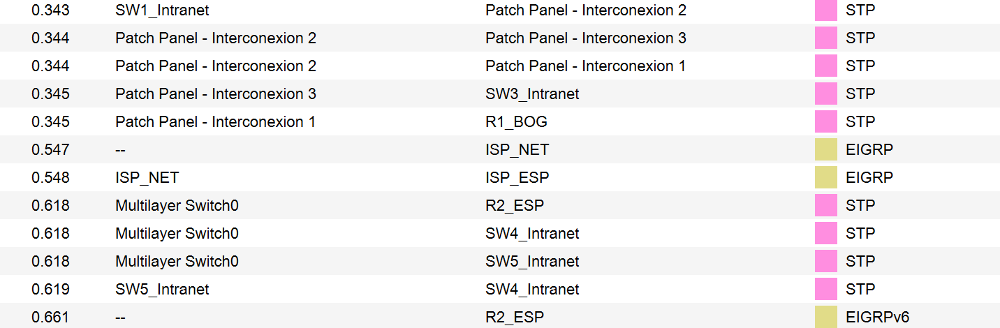
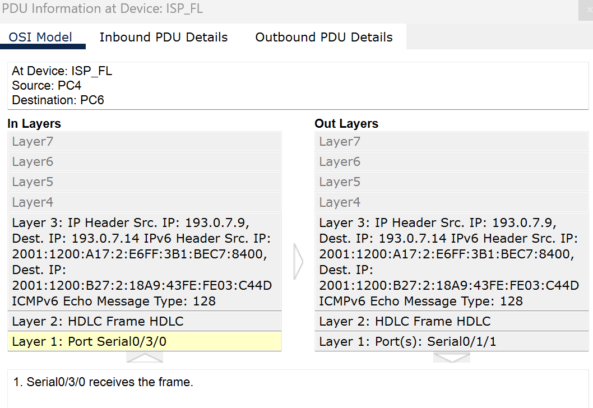
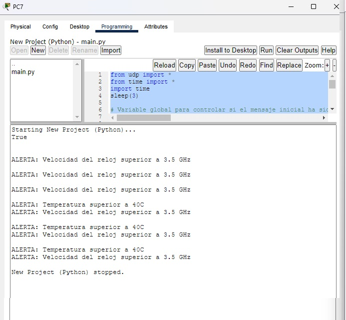

# DocumentacionLab3

## Miembros: Tomas Barrios Guevara, Valentina Ruiz Torres y Darek Aljuri Martínez

## 1. Introducción
En este laboratorio, se busca reforzar los conocimientos fundamentales sobre redes mediante la implementación de una topología empresarial utilizando Cisco Packet Tracer. Se trabajará con tecnologías LAN y WAN, combinando IPv4 e IPv6 en un entorno dual stack para garantizar la compatibilidad y migración eficiente entre ambos protocolos. Además, se configurarán servicios esenciales como DHCP, DNS y VPN IPsec, asegurando una conexión segura entre las intranets de diferentes ubicaciones.

Se establecerán políticas de acceso mediante listas de control de acceso (ACL) para regular la comunicación en función de protocolos HTTP y HTTPS, y se configurarán VLANs con protocolos de enrutamiento como OSPF o EIGRP para la gestión del tráfico intra e inter VLANs. También se desarrollará e integrará una aplicación de seguimiento remoto de activos mediante sockets, que permitirá monitorizar el rendimiento de los dispositivos en tiempo real. Finalmente, se documentarán las configuraciones realizadas, se evaluará el flujo de datos generado por las aplicaciones de seguimiento, y se garantizará la correcta gestión de red mediante SNMP.

## 2. Topología de red

Esta topología segmenta una empresa multinacional en dos grandes sedes (Bogotá y Madrid), donde las redes LAN están organizadas por VLANs y conectadas mediante una WAN que emplea protocolos de enrutamiento dinámico. La DMZ asegura el acceso seguro a servidores públicos, y la dualidad IPv4/IPv6 permite interoperabilidad y modernización en la infraestructura.

El cableado estructurado fue realizado en base a la plantilla de cableado que el docente sugirió guardar del segundo laboratorio. Los dispositivos adicionales agregados en este laboratorio se ubicaron en el último rack, y aquellos que no podían montarse en el rack, como las impresoras y los servidores, se colocaron en una mesa al lado del último rack.

### Zona Azul - DMZ (Zona Desmilitarizada):
Aloja servicios públicos expuestos al internet. Esta zona permite el acceso desde el exterior sin comprometer las redes internas.
  * Elementos:
    * Servidor Web: Server-PT (Web_Server): Según la página oficial de Hubspot "Un servidor web es una plataforma computacional que resguarda datos para ser consultados por diversos usuarios. Cuenta con un software que entrega la información solicitada por visitantes o miembros de un grupo de trabajo, a través de un dispositivo conectado a la red." [1].
  
    * Servidor DNS: Server-PT (DNS Server): "Un servidor DNS responde a las siglas Domain Name System, y nos permite relacionar una dirección escrita, a una dirección IP ." [2]. Dependiendo del registro que tengamos configurado y el software que soporte a dicha configuración.
  
    * Servidor Tracker: Server-PT (Tracker Server): Controla y registra eventos o datos específicos
    * Servidor DHCP: Asigna automáticamente direcciones IP a dispositivos dentro de la red. "Su función principal es simplificar la administración de direcciones IP, evitando conflictos y garantizando una conexión eficiente y ordenada."[3]
    * Switch 2960-24TT: SW_DMZ: Sirve para la interconexión de los servidores, segun la pagina oficial de cisco "es uno de los switches Cisco Catalyst de la serie 2960, que admiten voz, video, datos y acceso altamente seguro."[4].
  * Conexiones: Esta zona conecta con el Router R1_BOG para recibir y enviar solicitudes desde internet.

### Zona Amarilla - WAN (Red de Conexión ISP)

Conecta múltiples sedes a través de enlaces de internet y asegura la comunicación entre los routers usando algun protoolo de enrutamiento .
* Elementos:
  * Routers 2811:
    * ISP_NET (Core de los ISP)
    * R1_BOG (Router de la sede Bogotá)
    * R2_ESP (Router de la sede en España)
   
  * Los routers guían y dirigen los datos de red mediante paquetes que contienen varios tipos de datos, como archivos, comunicaciones y transmisiones simples como interacciones web.En este caso se usa el  2811 que "es un router de la serie 2800 de Cisco, diseñado principalmente para pequeñas y medianas empresas. Ofrece una combinación de funcionalidades de red y seguridad" [5]
* Espacio de Direcciones IPv4: 193.0.7.0/24

### Zona Naranja - Intranet Bogotá (BOG)

Segmenta la red local de la sede de Bogotá en varias VLANs para separar a los usuarios según su función.
* VLANs:
  * 10: VLAN Guest (PC1 - PC3) ---> Guest
  * 20: VLAN Internal (PC2 - PC4) ----> Internal
  * 30: VLAN Server/Printer----> servicio
  * 40: VLAN native ----> nativo
* Elementos:
  * Switches 2960 (SW1_Intranet, SW3_Intranet): Según la página oficial de Cisco los Switches Cisco Catalyst 2960-24TT forman parte de la serie Cisco Catalyst 2960. Esta serie es una familia de switches de capa 2 diseñados para implementaciones en redes de pequeñas y medianas empresas, además cuentan con "24 y 48 puertos de conectividad Gigabit Ethernet (GbE) de escritorio 10/100/1000 " [6].
  
  * Servidor DHCP para asignación dinámica de IPs
  * Impresoras: Printer0 y Printer1
  * Aplicación Tracker instalada en los PCs conectados

* Conexiones: Usa IPv6 en el espacio 2001:1200:A1X::/48

### Zona Verde - Intranet Madrid (MAD)
Implementa la red local de la sede Madrid con VLANs similares a las de Bogotá, pero para diferentes departamentos y funciones.
* VLANs:
  * 10: VLAN Guest (PC5 - PC8) ---> GuestMad 
  * 20: VLAN Internal (PC6-PC7) --->  InternalMad 
  * 30: VLAN Server/Printer ---> serviciosMad
  * 99: VLAN native ---> NativeMad
* Elementos:
  * Switch 2960 y 3560 (multicapa para el enrutamiento local), "Los switches compactos Cisco Catalyst 3560-CX y 2960-CX Series ayudan a optimizar las implementaciones de red. Estos conmutadores administrados Gigabit Ethernet (GbE) y Multigigabit Ethernet (mGig) son ideales para conectividad de datos de alta velocidad" [7]. En esta topologia permite la conexión y el enrutamiento entre VLANs en la sede de Madrid.
  * Impresoras: Printer2 y Printer3
  * PCs con el Dashboard del Tracker
* Conexiones: Espacio IPv6 2001:1200:B2X::/48

## 3. Síntesis de la metodología y resultados de configuración: 
* **Montaje de la topología:**
  
Utilizando el cableado estructurado y los modelos de dispositivos indicados, se recreó la topología de red en Cisco Packet Tracer siguiendo la configuración establecida. En esta red, se utilizaron routers Cisco 2811 en todas las interconexiones principales y en la red WAN del ISP. Cada router está conectado entre sí para simular la interconexión WAN y permitir la conectividad entre las distintas sedes, haciendo uso de los protocolos de enrutamiento EIGRP y OSPF. Los routers se configuraron para manejar direcciones IPv4 e IPv6, asignando espacios de red como **193.0.7.0/24** para Internet y **2001:1200::/48** para enlaces internos y loopbacks.

Para gestionar el tráfico dentro de cada sede, se emplearon switches Cisco 2960 como elementos de acceso. En la sede de Madrid (MAD), se implementó un switch Multilayer 3650 como dispositivo de capa 3, encargado de realizar el enrutamiento entre VLANs locales para optimizar el tráfico y mejorar el rendimiento interno. Se configuraron múltiples VLANs en cada sede, asignando diferentes roles a los dispositivos finales, como VLAN de invitados, internos, servidores e impresoras.

En la zona DMZ, se instalaron servidores esenciales (DNS, web y tracker) para brindar servicios accesibles desde las sedes internas y desde Internet, aislando estos servicios críticos del tráfico de la intranet para mayor seguridad. El servidor DHCP se configuró para proporcionar direcciones IP automáticamente a los dispositivos de la red, mientras que los servidores web y DNS facilitan el acceso a recursos tanto internos como externos.

La topología diseñada asegura una segmentación lógica eficiente mediante VLANs, conectividad global a través de la WAN y servicios críticos disponibles en la DMZ. El uso del switch Multilayer 3650 en Madrid permite además una gestión avanzada del tráfico entre las diferentes VLANs y mejora la eficiencia del enrutamiento en la red interna.

* **Esquema de direccionamiento:**
Se diseñó un esquema de direccionamiento basado en los requerimientos de las VLAN, asignando rangos de direcciones según la cantidad de dispositivos. Se realizó el Subneteo y se construyó una tabla de direccionamiento para toda la topología
  * *ipv4*

    | |  |
    |:----------------------------------------------:|:---------------------------------------------------------:|

  * *ipv6*

  Se llevó a cabo un proceso de subneteo en dos ciudades: Bogotá y Madrid. Ambas ubicaciones contaban con una red inicial de prefijo /48 y el objetivo era dividirlas en subredes de prefijo /64 para poder implementar 4 VLANs en cada ciudad.

     ***Proceso de Subneteo en Madrid***
  
     Red inicial: 2001:1200:B27::/48
  
     Objetivo: Subnetear a /64 para generar 4 VLANs.
  
     El prefijo /48 permite utilizar 16 bits adicionales para subredes, lo que proporciona hasta 65,536 posibles subredes /64. En este caso, se generaron las primeras 4 subredes, asignando cada una a una VLAN específica:

             VLAN 1: 2001:1200:B27:0001::/64
             VLAN 2: 2001:1200:B27:0002::/64
             VLAN 3: 2001:1200:B27:0003::/64
             VLAN 4: 2001:1200:B27:0004::/64

    ***Proceso de Subneteo en Bogotá***
    Red inicial: 2001:1200:A17::/48
  
    Objetivo: Dividir la red en subredes /64 para implementar 4 VLANs.
  
    Siguiendo el mismo método, el se crearon 4 subredes a partir del prefijo /48, asignando una a cada VLAN en Bogotá:
  
            VLAN 1: 2001:1200:A17:0001::/64
            VLAN 2: 2001:1200:A17:0002::/64
            VLAN 3: 2001:1200:A17:0003::/64
            VLAN 4: 2001:1200:A17:0004::/64
  
   ***Resumen del Subneteo en Bogotá y Madrid***
   En ambas redes, se empleó un esquema de subneteo consistente y eficiente, segmentando de /48 a /64 para las VLANs. Esto permitió una organización clara y estructura de direccionamiento sin conflictos, con cada VLAN en una subred /64 distinta en ambas ciudades.

  
* **Asignacion y Verificacion de IPV4-IPV6:**
  
   *¿Qué método de asignación se debe configurar?*
  
  El método de asignación configurado fue ***DHCPv6 Stateful*** en ambas sedes (Bogotá y Madrid). Esta elección se fundamentó en la necesidad de centralizar y controlar la asignación de direcciones IPv6, permitiendo a los dispositivos recibir tanto sus direcciones IP como la configuración de DNS, esencial para el acceso a la aplicación y a su respectiva página.

   ***Métodos de asignación considerados:***

   **SLAAC**: No era viable por sí solo, ya que, aunque permitía a los dispositivos autoconfigurarse, no podía asignar la dirección del servidor DNS necesaria para la comunicación con el sistema.

   **Stateless DHCP:** Ofrecía la posibilidad de que los dispositivos generaran su dirección mediante SLAAC, pero recibieran información adicional (como la dirección del DNS) a través de un servidor DHCP. Sin embargo, no proporcionaba el control sobre la asignación de direcciones IP.

   **DHCPv6 Stateful:** Elegido debido a su capacidad de asignar y controlar las direcciones IP desde un servidor central, lo que permitía registrar cada dispositivo conectado y ofrecer configuración completa de red.

   - ***DHCPV6 en Bogota***
  
   En el Router de la Sede (Bogotá): Se configura el servicio de DHCPv6 Stateful para cada VLAN. El router se encarga de asignar direcciones IPv6 a los dispositivos finales en cada VLAN y de distribuir la información de red necesaria. Esto incluye la configuración de los pools de direcciones para cada VLAN y la activación de la bandera de DHCP Stateful, de modo que los dispositivos sepan que deben obtener toda su configuración de red del router.

                      ipv6 dhcp pool VLAN10_Guest
                      address prefix 2001:1200:A17:1::/64 lifetime 172800 86400
                      dns-server 2001:1200:C17:4::2
                      domain-name VLAN10_Guest
                     !
                     ipv6 dhcp pool VLAN20_Internal
                      address prefix 2001:1200:A17:2::/64 lifetime 172800 86400
                      dns-server 2001:1200:C17:4::2
                      domain-name VLAN20_Internal
                     !
                     ipv6 dhcp pool VLAN30_Servicio
                      address prefix 2001:1200:A17:3::/64 lifetime 172800 86400
                      dns-server 2001:1200:C17:4::2
                      domain-name VLAN30_Servicio
                     !
                     ipv6 dhcp pool VLAN40_Nativo
                      address prefix 2001:1200:A17:4::/64 lifetime 172800 86400
                     !
   Y en las interfaces, las configuraciones de DHCPv6 son las siguientes:

                      interface FastEthernet0/0.10
                      encapsulation dot1Q 10
                      ipv6 address 2001:1200:A17:1::1/64
                      ipv6 nd managed-config-flag
                      ipv6 dhcp server VLAN10_Guest
                     !
                     interface FastEthernet0/0.20
                      encapsulation dot1Q 20
                      ipv6 address 2001:1200:A17:2::1/64
                      ipv6 nd managed-config-flag
                      ipv6 dhcp server VLAN20_Internal
                     !
                     interface FastEthernet0/0.30
                      encapsulation dot1Q 30
                      ipv6 address 2001:1200:A17:3::1/64
                      ipv6 nd managed-config-flag
                      ipv6 dhcp server VLAN30_Servicio
                     !
                     interface FastEthernet0/0.99
                      encapsulation dot1Q 99
                      ipv6 address 2001:1200:A17:4::1/64
                      ipv6 nd managed-config-flag
                      ipv6 dhcp server VLAN40_Nativo

   Esta configuración establece pools DHCPv6 para cada VLAN y asigna un prefijo de dirección IPv6, un tiempo de vida para las direcciones, un servidor DNS, y un nombre de dominio para cada VLAN. Las interfaces asociadas a cada VLAN tienen configurado el flag managed-config para habilitar la configuración automática administrada, y se especifica el pool DHCP correspondiente para cada interfaz.

  Como se ven las IPs en diferentes dispositivos, perteneciente a VLANS distintas dentro de la intranet de Bog.

 
  

   ***En el Servidor DHCP (Bogotá):*** Este servidor también tiene configurados los pools de direcciones para cada VLAN (como VLAN10_Guest, VLAN20_Internal, VLAN30_Servicio, y VLAN40_Nativo). El servidor DHCP actúa como un respaldo y proporciona flexibilidad en la administración de la configuración para cada VLAN, en caso de que se requiera algún cambio específico en las configuraciones asignadas a las VLANs. Aunque intentaron utilizar el servidor como el principal proveedor de direcciones, finalmente se optó por la configuración en el router debido a limitaciones en Packet Tracer.
 

***DHCPV6 en Madrid***

  En el Router de la Sede (Madrid): Se configura el servicio de DHCPv6 Stateful para cada VLAN. El router se encarga de asignar direcciones IPv6 a los dispositivos finales en cada VLAN y de distribuir la información de red necesaria. Esto incluye la configuración de los pools de direcciones para cada VLAN y la activación de la bandera de DHCP Stateful, de modo que los dispositivos sepan que deben obtener toda su configuración de red del router. A esta configuración se le incluye lo configurado en el MLS para la comunicación inter vlan, configuración presentada mas adelante en la documentación

                     ipv6 dhcp pool VLAN10_guestMAD
                      address prefix 2001:1200:B27:1::/64 lifetime 172800 86400
                      dns-server 2001:1200:C17:4::2
                      domain-name guestMAD
                     !
                     ipv6 dhcp pool VLAN20_internalMAD
                      address prefix 2001:1200:B27:2::/64 lifetime 172800 86400
                      dns-server 2001:1200:C17:4::2
                      domain-name internalMAD
                     !
                     ipv6 dhcp pool VLAN30_servicioMAD
                      address prefix 2001:1200:B27:3::/64 lifetime 172800 86400
                      dns-server 2001:1200:C17:4::2
                      domain-name servicioMAD
                     !
                     ipv6 dhcp pool VLAN40_nativoMAD
                      address prefix 2001:1200:B27:4::/64 lifetime 172800 86400
                      omain-name nativoMAD
                     !
 Y en las interfaces, las configuraciones de DHCPv6 Son las siguientes:
 
                    interface FastEthernet0/0.10
                    encapsulation dot1Q 10
                    no ip address
                    ipv6 traffic-filter ACL_mad in
                    ipv6 address 2001:1200:B27:1::1/64
                    ipv6 nd managed-config-flag
                    ipv6 eigrp 100
                    ipv6 dhcp server VLAN10_guestMAD
                   !
                   interface FastEthernet0/0.20
                    encapsulation dot1Q 20
                    no ip address
                    ipv6 traffic-filter ACL_mad in
                    ipv6 address 2001:1200:B27:2::1/64
                    ipv6 nd managed-config-flag
                    ipv6 eigrp 100
                    ipv6 dhcp server VLAN20_internalMAD
                   !
                   interface FastEthernet0/0.30
                    encapsulation dot1Q 30
                    no ip address
                    ipv6 traffic-filter ACL_mad in
                    ipv6 address 2001:1200:B27:3::1/64
                    ipv6 nd managed-config-flag
                    ipv6 eigrp 100
                    ipv6 dhcp server VLAN30_servicioMAD
                   !
                   interface FastEthernet0/0.99
                    encapsulation dot1Q 99
                    no ip address
                    ipv6 address 2001:1200:B27:4::1/64
                    ipv6 nd managed-config-flag
                    ipv6 eigrp 100
                    ipv6 dhcp server VLAN99_nativoMAD

   ***Explicación:***
   
Pools DHCPv6: Cada pool define un rango de direcciones IPv6 con su respectivo lifetime (tiempo de vida) y configuración adicional, como los servidores DNS y el dominio.

Interfaces: En cada interfaz de VLAN (por ejemplo, FastEthernet0/0.10 para VLAN 10), se habilita el servidor DHCPv6 para que asignen direcciones a los dispositivos conectados a esa VLAN. Se utiliza el comando ipv6 dhcp server <nombre_del_pool> para asociar el pool de direcciones con la interfaz correspondiente.

ipv6 nd managed-config-flag: Esto indica que el router debe enviar la configuración DHCPv6 (dirección IPv6) junto con la respuesta de Neighbor Discovery (ND).
     
  - En el contexto de DHCPv6 (Protocolo de Configuración Dinámica de Host para IPv6), las "banderas" se refieren a ciertas opciones dentro de los mensajes de DHCPv6 que indican cómo se debe manejar la configuración de los dispositivos que solicitan una dirección IP. Estas banderas son parte de los mensajes que el cliente envía para especificar qué tipo de configuración espera recibir del servidor DHCP. Existen varias banderas clave que se pueden incluir en un mensaje de DHCPv6.

    En particular, en el caso de una configuración stateful de DHCPv6 (donde el servidor asigna una dirección IP y también administra el estado de la configuración), hay una bandera importante:

    1. Flag "M" (Managed Address Configuration Flag) Descripción: Esta bandera indica si el servidor DHCPv6 debe proporcionar una dirección IP al cliente junto a la otra información que contenga el servidor DHCP, que en nuestro caso tambien fue el servidor DNS.

       ¿Qué significa?: Si el servidor DHCPv6 responde con esta bandera activada, significa que está proporcionando direcciones stateful al cliente (es decir, el servidor está gestionando la asignación de direcciones IPv6).

       En el caso de un entorno DHCPv6 stateful: El servidor proporciona direcciones IPv6 completas (con sus direcciones y configuraciones), y el cliente no necesita autoconfigurar sus direcciones. En un escenario stateless (sin estado), el servidor DHCPv6 solo proporciona configuraciones adicionales, pero el cliente obtiene su dirección a través de SLAAC (Stateless Address Autoconfiguration).

    3. Proceso de DHCPv6 y la Bandera "M":
    4. 
        Fase de Solicitud: Cuando un dispositivo (cliente) se conecta a la red, envía una solicitud de DHCPv6, normalmente con un paquete Solicit.
        Fase de Respuesta: El servidor responde con un paquete Advertise, que puede contener las banderas activadas: Si la bandera M está activada, el servidor DHCP está gestionando las direcciones IPv6. Si la bandera O está activada, el servidor está proporcionando configuraciones adicionales (como DNS).
       Fase de Confirmación: El cliente responde con un paquete Request, aceptando la oferta, y el servidor envía finalmente un paquete Reply con las configuraciones y direcciones asignadas.
       
    5. ¿Por qué se usa una bandera para "stateful" en DHCPv6? En un escenario stateful, el servidor DHCP no solo asigna direcciones IP, sino que también mantiene un registro de las direcciones asignadas a cada dispositivo. Esto contrasta con un modelo stateless, en el que el dispositivo se asigna una dirección automáticamente usando SLAAC y solo recurre al servidor DHCP para obtener configuraciones adicionales (como servidores DNS). La bandera "M" es crucial porque indica que el servidor DHCP está configurado para administrar las direcciones de red, lo que es típico en redes donde el control centralizado y la gestión de direcciones son importantes (por ejemplo, para evitar conflictos de direcciones o para garantizar que las direcciones sean únicas y se mantengan organizadas).

   Como se ven las IPs en diferentes dispositivos, perteneciente a VLANS distintas en la intranet de Mad.

 
  
  
* **Configuracion routers:**
Se configuraron los routers Cisco 2811 para soportar el enrutamiento estático y dinámico mediante ***OSPF y EIGRP***, permitiendo la interconexión eficiente de las redes de las sedes y la DMZ. Además, se habilitaron direcciones IPv6 en cada router, tanto en las interfaces internas como en las WANs.

EIGRP en los routers R1_BOG, ISP_BOG, ISP_NET, ISP_ESP y R2_ESP: EIGRP es un protocolo de enrutamiento interior que ofrece una convergencia rápida y eficiencia en el uso de ancho de banda. Se utiliza en la red para asegurar una comunicación eficiente entre los routers dentro de una misma área administrativa. Al implementarlo en los routers R1_BOG, ISP_BOG, ISP_NET, ISP_ESP y R2_ESP, se puede facilitar el enrutamiento entre los dispositivos sin la necesidad de configuraciones externas. Al igual, permite soporte para redes IPv6, haciendo efectivas las transiciones entre IPv4 e IPv6.

                    Se haria esta configuración los routers requeridos

                    EIGRP
                    router eigrp 100
                    network 193.0.7.0 0.0.0.3
                    network 193.0.7.4 0.0.0.3
                    network 193.0.7.16 0.0.0.3

Esta configuración activa el proceso de EIGRP con el número de sistema autónomo 100, lo que permite el enrutamiento dinámico dentro de las redes especificadas. Las líneas network 193.0.7.0 0.0.0.3, network 193.0.7.4 0.0.0.3, y network 193.0.7.16 0.0.0.3 indican a EIGRP que incluya estas subredes en su proceso de enrutamiento. Esto significa que las interfaces del router en esas subredes participarán en EIGRP

OSPF v2.0 en los routers ISP_BOG, ISP_FL y ISP_ESP: es un protocolo de enrutamiento interior basado en el estado de enlace que permite enrutamiento jerárquico y escalable, ideal para redes grandes. Esto facilita el intercambio de rutas entre diferentes segmentos, especialmente en redes de gran escala. Su capacidad para calcular la mejor ruta basada en el costo (generalmente relacionado con el ancho de banda) optimiza el rendimiento y minimiza la latencia en las rutas críticas.

                    Se haria la siguiente configuracion para los routers requeridos

                    router ospf 1
                    log-adjacency-changes
                    redistribute eigrp 100 subnets 
                    network 193.0.7.8 0.0.0.3 area 0
                    network 193.0.7.12 0.0.0.3 area 0

Esta configuración en el router activa el proceso de OSPF, permitiendo el enrutamiento dinámico en la red. La opción log-adjacency-changes habilita la generación de mensajes en el router cada vez que se establecen o pierden adyacencias OSPF con otros routers, facilitando el monitoreo de cambios en las conexiones. La línea redistribute eigrp 100 subnets permite que las rutas aprendidas por EIGRP en el sistema autónomo 100 sean compartidas dentro de OSPF, lo que permite la interoperabilidad y el intercambio de rutas entre ambos protocolos. Las líneas network 193.0.7.8 0.0.0.3 area 0 y network 193.0.7.12 0.0.0.3 area 0 especifican las subredes que OSPF debe anunciar en el área, lo que incluye esas interfaces en el proceso de OSPF y permite el intercambio de rutas en esas subredes dentro del área central de la red.

* **Configuracion Switches 2960:**
Los switches de acceso Cisco 2960 se configuraron para soportar VLANs y permitir la conectividad dentro de cada sede. Se definieron las VLANs para separar el tráfico según los roles (invitados, internos, servidores). Además, se habilitó trunking en los puertos hacia los routers para permitir la propagación de las VLANs hacia otras sedes.

* **Configuracion  Multilayer Switch (MLSW) 3650 :**
El switch Multilayer 3650 en Madrid se configuró como dispositivo de capa 3 para gestionar el enrutamiento entre VLANs locales, lo que optimiza el tráfico dentro de la sede. Se habilitó Inter-VLAN routing en este dispositivo, y se configuraron las interfaces SVI para cada VLAN interna.

                  ! Configuración de VLANs
                                    vlan 10
                                      name GuestMad
                                    vlan 20
                                      name InternalMad
                                    vlan 30
                                      name ServiciosMad
                                    vlan 99
                                      name nativeMad
                   
                   ! Configuración del Trunk en el puerto hacia el router
                   interface Ga (varia del switch)
                     switchport mode trunk
                     switchport trunk native vlan 99
                     switchport trunk allowed vlan 10,20,30

     
                  ! Configuracion para la comunicación inter vlan
                  interface Vlan10
                   ipv6 address 2001:1200:B27:1::1/64
                   ipv6 nd managed-config-flag
   
                  
                  interface Vlan20
                   ipv6 address 2001:1200:B27:2::1/64
                   ipv6 nd managed-config-flag
   
                  
                  interface Vlan30
                   ipv6 address 2001:1200:B27:3::1/64
                   ipv6 nd managed-config-flag
                  
                  interface Vlan99
                   ipv6 address 2001:1200:B27:4::1/64
                   ipv6 nd managed-config-flag

* **Configuración de VLANs y Enlace Trunk (802.1Q)**
Debido a la segmentación entre VLANs, es necesario configurar los trunks en los switches para permitir que las VLANs se comuniquen entre sí y con los routers.

 * Configuración en los switches (Bogotá)
   
                 ! Configuración de VLANs
                 vlan 10
                   name Guest
                 vlan 20
                   name Internal
                 vlan 30
                   name Servicio
                 vlan 40
                   name Native

                 ! Configuración de las interfaces a los end devices
                  interface Fa (varia del switch)
                  switchport access vlan xx (Numero de la VLAN varia de acuerdo a cual end device va la interface y a que Vlan pertenece)
                 
                 ! Configuración del Trunk en el puerto hacia el router
                 interface Fa (varia del switch)
                   switchport mode trunk
                   switchport trunk native vlan 40
                   switchport trunk allowed vlan 10,20,30
   

   

 * En los dos switches (Madrid)
   
                   ! Configuración de VLANs
                   vlan 10
                     name GuestMad
                   vlan 20
                     name InternalMad
                   vlan 30
                     name ServiciosMad
                   vlan 99
                     name nativeMad
                   
                   ! Configuración del Trunk en el puerto hacia el router
                   interface fa (varia del switch)
                     switchport mode trunk
                     switchport trunk native vlan 99
                     switchport trunk allowed vlan 10,20,30

* **Configuración túneles:**
 El tunneling se usa para permitir la comunicación segura entre dos puntos de la red ( en la topología los routers ISP_BOG e ISP_ESP) que están en diferentes redes, en este caso intranets. El tunneling encapsula los paquetes de un protocolo en otro, permitiendo que la información viaje a través de una infraestructura compartida o insegura (como Internet) sin comprometer la privacidad ni la integridad de los datos. En la topología, el túnel entre ISP_BOG e ISP_ESP lo usamos para encapsular los mensajes con dirección IPv6 que vienen de cualquiera de las intranets en la zona de internet que es IPv4, permitiendo el paso de una dirección IPv6 en una red IPv4.

                    interface Tunnel0
                    no ip address
                    mtu 1476
                    ipv6 address 2001:1200:E17:1::2/64
                    ipv6 eigrp 100
                    ipv6 rip REDV6 enable 
                    tunnel source Serial0/2/1
                    tunnel destination 193.0.7.14
                    tunnel mode ipv6ip
  
Esta configuración en la interfaz Tunnel0 crea un túnel IPv6 sobre IPv4, permitiendo que el tráfico IPv6 viaje a través de una infraestructura IPv4. La interfaz utiliza una dirección IPv6 2001:1200:E17:1::2/64 (en este caso) y está configurada para participar en el enrutamiento IPv6 mediante EIGRP y RIPng, lo que facilita el intercambio de rutas IPv6 con otros routers compatibles. La fuente del túnel es la interfaz Serial0/2/1, y el destino es la dirección IPv4 193.0.7.14, encapsulando los paquetes IPv6 en un encabezado IPv4 para que puedan atravesar la red IPv4 hasta el router remoto. El ajuste del MTU a 1476 bytes ayuda a evitar la fragmentación de los paquetes en este proceso de encapsulación.

VPN IPSec en los routers del tunneling: La VPN IPSec se utiliza para asegurar el túnel proporcionando confidencialidad, integridad y autenticación de los datos que se envían. En esta configuración, la VPN IPSec protege los datos en tránsito, asegurando que solo los routers autorizados (en este caso ISP_BOG e ISP_ESP) puedan acceder a la información que viaja a través del túnel

                   crypto isakmp policy 10
                    authentication pre-share
                    hash sha
                    encryption aes 256
                    group 2
                    lifetime 86400
                   exit
                   
                   crypto isakmp key toor address 193.0.7.14
                   
                   crypto ipsec transform-set TSET esp-aes esp-sha-hmac
                   
                   access-list 101 permit ip 193.0.7.1 0.0.0.3 193.0.7.14 0.0.0.3
                   
                   crypto map CMAP 10 ipsec-isakmp
                    set peer 193.0.7.14
                    match address 101
                    set transform-set TSET
                   exit
                   
                   interface se0/2/1
                    crypto map CMAP
                   
                   do wr

Esta configuración establece una VPN IPSec entre dos routers mediante el protocolo ISAKMP, proporcionando seguridad y cifrado para el tráfico de red. Primero, en la política ISAKMP (número 10), se define la autenticación pre-compartida, usando el algoritmo de hash SHA para integridad y el cifrado AES de 256 bits para privacidad. El grupo 2 especifica el grupo Diffie-Hellman para el intercambio de claves, y la vida útil del SA es de 86400 segundos (24 horas). La clave pre-compartida toor se asocia con la dirección 193.0.7.14, que corresponde al router remoto.
Luego, se crea un conjunto de transformaciones (transform-set) llamado TSET, que usa esp-aes para el cifrado y esp-sha-hmac para integridad. La lista de acceso 101 permite el tráfico entre la red 193.0.7.1 y la red 193.0.7.14, especificando qué tráfico será protegido por IPSec. Después, se configura un mapa de criptografía (crypto map) llamado CMAP que aplica IPSec-ISAKMP, establece el router remoto como 193.0.7.14, asocia el conjunto de transformaciones TSET y aplica la lista de acceso 101 para seleccionar el tráfico. Finalmente, este mapa de criptografía se aplica a la interfaz se0/2/1, que conecta con el router remoto, activando así la VPN en esa interfaz.

* **Configuración SNMP:**

SNMP en los routers R1_BOG y R2_ESP: SNMP es un protocolo de administración de redes que permite monitorear y gestionar dispositivos de red. En este caso, se ha configurado en los routers R1_BOG y R2_ESP para supervisar el estado y el rendimiento de estos routers críticos. Esto es útil para detectar problemas o fallos y recopilar información sobre la red, lo que ayuda a los administradores a mantener la red operativa y a realizar ajustes si es necesario.

                    snmp-server community BOGRO RO
                    snmp-server community BOGRW RW

Esta configuración establece dos comunidades SNMP en el router para la administración de la red. La línea snmp-server community BOGRO RO crea una comunidad llamada BOGRO con permisos de solo lectura (RO, "Read-Only"), lo que permite a los administradores de red monitorear el router sin realizar cambios en su configuración. La línea snmp-server community BOGRW RW define otra comunidad llamada BOGRW con permisos de lectura y escritura (RW, "Read-Write"), permitiendo tanto la monitorización como la capacidad de modificar configuraciones en el router.

Para cumplir con el requerimiento de que solo las máquinas en la VLAN internal tengan acceso al servicio SNMP, se implementaron listas de acceso (ACLs) para restringir las solicitudes SNMP basadas en las direcciones IP de origen, asegurando que solo los equipos autorizados puedan comunicarse con los routers.

***ACL para Bogotá (Router R1_BOG):***

                   permit udp 2001:1200:A17:2::/64 any eq snmp
                   deny udp 2001:1200:A17:1::/64 any eq snmp
                   deny udp 2001:1200:A17:3::/64 any eq snmp
                   deny udp 2001:1200:A17:4::/64 any eq snmp

 Permit udp 2001:1200:A17:2::/64 any eq snmp: Permite el acceso SNMP solo a las direcciones de la subred 2001:1200:A17:2::/64, que corresponde a la VLAN internal en Bogotá.
 
 deny udp 2001:1200:A17:1::/64 any eq snmp: Niega el acceso SNMP a cualquier dirección de la subred 2001:1200:A17:1::/64 (se niega el acceso a las otras VLANS)
 
 deny udp 2001:1200:A17:3::/64 any eq snmp: Niega el acceso SNMP a cualquier dirección de la subred 2001:1200:A17:3::/64.
 
 deny udp 2001:1200:A17:4::/64 any eq snmp: Niega el acceso SNMP a cualquier dirección de la subred 2001:1200:A17:4::/64.

 ***ACL para Madrid (Router R2_ESP):***

                permit udp 2001:1200:B27:2::/64 any eq snmp
                deny udp 2001:1200:B27:1::/64 any eq snmp
                deny udp 2001:1200:B27:3::/64 any eq snmp
                deny udp 2001:1200:B27:4::/64 any eq snmp
                permit ipv6 any any

 permit udp 2001:1200:B27:2::/64 any eq snmp: Permite el acceso SNMP solo a las direcciones de la subred 2001:1200:B27:2::/64, que corresponde a la VLAN internal en Madrid.

 deny udp 2001:1200:B27:1::/64 any eq snmp: Niega el acceso SNMP a cualquier dirección de la subred 2001:1200:B27:1::/64.

 deny udp 2001:1200:B27:3::/64 any eq snmp: Niega el acceso SNMP a cualquier dirección de la subred 2001:1200:B27:3::/64.

 deny udp 2001:1200:B27:4::/64 any eq snmp: Niega el acceso SNMP a cualquier dirección de la subred 2001:1200:B27:4::/64.

 permit ipv6 any any: Permite todo el tráfico IPv6 restante (para asegurar que no haya bloqueos indeseados para otros servicios).

***Explicación:***
Las ACLs están diseñadas para garantizar que solo los equipos en la subred correspondiente a la VLAN internal puedan acceder a SNMP en los routers. Esto se logra al permitir explícitamente el tráfico UDP en el puerto de SNMP (puerto 161) desde las subredes específicas de cada VLAN internal, y denegar el acceso desde otras subredes. Así, los administradores pueden monitorear y administrar el rendimiento de los routers sin comprometer la seguridad de la red, limitando el acceso solo a los dispositivos autorizados.

La ACL para Bogotá se asegura de que solo los dispositivos en la subred 2001:1200:A17:2::/64 puedan usar SNMP, mientras que las otras subredes están bloqueadas.
De manera similar, la ACL para Madrid permite solo la subred 2001:1200:B27:2::/64 para acceder al SNMP, asegurando que otros dispositivos no puedan conectarse.

  
  
 Para probar el SNMP se debe accedre al MIB Browser de un PC y configurar los campos de la siguiente manera, en este caso en la red de bogota, cabe resaltar que al ser el PC2 que se encuentra en la VLAN de internal, se va a poder hacer el proceso de SNMP porque elñ puerto va a estar desbloqueado:

Address: Usa la default gateway del router, en este caso, 2001:1200:A17:2::1.
OID: Utiliza un OID de prueba, como .1.3.6.1.2.1.1.1.0 
Operations: Selecciona Get.
Community String: Usa BOGRO (si es solo lectura) o BOGRW (si es lectura/escritura).

 
 
En este caso al ser el PC 1 de la VLAN guest no se puede hacer el proceso de SNMP

Y para el caso de Madrid el community String cambia  es ESPRO para lectura

* **Filtros de paquetes y listas de control de acceso (ACLs):**
  * ***Requerimientos de filtrado de tráfico:***
      * Intranet Bogotá (BOG):
        * Los usuarios internos solo pueden acceder al servidor web mediante HTTPs (puerto 443).
        * Usuarios invitados acceden a la web mediante HTTP (puerto 80), no se les permite usar HTTPs.
      * Intranet Madrid (MAD):
        * Los usuarios internos acceden solo mediante HTTPs (puerto 443).
        * Usuarios invitados solo tienen acceso por HTTP (puerto 80), con el acceso a HTTPs (puerto 443) restringido.
      * Zona DMZ:
        * El servidor web estará disponible en la DMZ y gestionado por un servidor DNS.
        * El nombre de dominio para la página web personalizada tendrá el formato (dvt.net)
         
  * ***Implementación de ACLs (Listas de Control de Acceso):***
  "Una ACL es una serie de comandos del IOS que controlan si un router reenvía o descarta paquetes según la información   que se encuentra en el encabezado del paquete. Las ACL son una de las características del software IOS de Cisco más utilizadas." [8]. Las ACLs se aplicarán en los routers de las sedes y la DMZ para garantizar que el tráfico se filtre de acuerdo con las reglas definidas.
    * Ubicación de las ACLs:
      * En el router de salida de Bogotá (BOG):
        Configurar una ACL que permita:
          * HTTPS (puerto 443) solo para usuarios internos de la VLAN.
          * HTTP (puerto 80) solo para usuarios invitados.
      * En el router de Madrid (MAD):
      Configurar una ACL que:
        * Deniegue HTTPS (puerto 443) para los usuarios invitados.
        * Permita HTTP (puerto 80) solo para los invitados.
        * Permita HTTPS (puerto 443) exclusivamente para usuarios internos.
          
    * Configuración de las ACLs en los routers:
       para Bogotá (BOG):

                  ipv6 access-list ACL_Bogota_Web
                  permit tcp 2001:1200:A17:2::/64 any eq 443
                  permit tcp 2001:1200:A17:3::/64 any eq 443
                  permit tcp 2001:1200:A17:4::/64 any eq 443
                  permit tcp 2001:1200:A17:1::/64 any eq www
                  deny tcp 2001:1200:A17:2::/64 any eq www
                  deny tcp 2001:1200:A17:3::/64 any eq www
                  deny tcp 2001:1200:A17:4::/64 any eq www
                  deny tcp 2001:1200:A17:1::/64 any eq 443
       
       Explicación línea por línea:
      
         * *ipv6 access-list ACL_Bogota_Web*
           
            Define una lista de acceso IPv6 llamada ACL_Bogota_Web.

        * *permit tcp 2001:1200:A17:2::/64 any eq 443*
          
          Permite el tráfico HTTPS (TCP puerto 443) desde cualquier dirección dentro de la subred 2001:1200:A17:2::/64 hacia cualquier destino. Esta instruccion se repite para la VLAN 3 y 4

        * *permit tcp 2001:1200:A17:1::/64 any eq www*

         Permite el tráfico HTTP (TCP puerto 80, comúnmente representado como www) desde cualquier dirección en la subred 2001:1200:A17:1::/64 hacia cualquier destino.

       * *deny tcp 2001:1200:A17:2::/64 any eq www*

           Niega el tráfico HTTP desde cualquier dirección en la subred 2001:1200:A17:2::/64 hacia cualquier destino, esto mismo sucede con la direccion de la VLAN 3 y 4

       * *deny tcp 2001:1200:A17:1::/64 any eq 443*

          Niega el tráfico HTTPS desde cualquier dirección en la subred 2001:1200:A17:1::/64 hacia cualquier destino.

    * Aplicación de las ACLs en las interfaces:
          
          * por ejemplo:

                         interface FastEthernet0/0.10
                          encapsulation dot1Q 10
                          no ip address
                          ipv6 traffic-filter ACL_Bogota_Web in
                          ipv6 address 2001:1200:A17:1::1/64

     Se tiene que declarar la interfaz y luego se usa la linea *ipv6 traffic-filter ACL_Bogota_Web in* para decir que se va a estar implementando esa access list

**Software Tracker**

La solución “Tracker” está diseñada para monitorear de manera remota los recursos de un PC en tiempo real, permitiendo a un técnico visualizar datos críticos como temperatura y velocidad del procesador, y actuar en caso de alertas. El flujo del sistema funciona de la siguiente manera:

Captura de mediciones en la aplicación “Tracker App”

El PC4, ubicado en la Intranet de Bogotá (BOG), ejecuta la aplicación “Tracker App”. Esta aplicación genera mediciones de temperatura y velocidad del procesador de manera aleatoria dentro de los rangos:
Temperatura: 30°C - 50°C
Velocidad del procesador: 3.5 GHz - 4.0 GHz
Estas mediciones se envían al servidor “Tracker Server”, ubicado en la zona DMZ, cada segundo.
Reenvío de mediciones desde el servidor

El “Tracker Server” recibe las mediciones y las procesa mediante la aplicación “Tracker Replay”, que reenvía los datos al PC7, ubicado en la Intranet de Madrid (MAD).
La aplicación en el PC7, llamada “Tracker Dashboard”, permite al técnico visualizar las mediciones y las alertas generadas si:
La temperatura supera los 40°C
La velocidad del procesador supera los 3.5 GHz

  * ***Uso de sockets para la comunicación entre las aplicaciones***

    Un socket es un punto final de comunicación entre dos aplicaciones, utilizado para intercambiar datos a través de una red. En este sistema, los sockets permiten que las aplicaciones “Tracker App”, “Tracker Replay” y “Tracker Dashboard” se comuniquen de manera eficiente, enviando y recibiendo    
    mensajes en tiempo real.
  
   Tracker App a Tracker Server:
   Utiliza un socket para transmitir las mediciones generadas en PC4 al servidor.
   Tracker Server a Tracker Dashboard:
   La aplicación “Tracker Replay” usa sockets para reenviar las mediciones al PC7 en Madrid

  * ***Solución al uso de direcciones IP dinámicas (DHCP Stateful)***
    
   Dado que el sistema utiliza un servidor DHCP Stateful, las direcciones IP asignadas a los dispositivos, incluido el PC7, son dinámicas. Esto presenta un desafío, ya que el “Tracker Server” necesita conocer la dirección IP actual del PC7 para poder enviarle los datos correctamente.

   Para resolver esto:

  PC7 envía un mensaje inicial al Tracker Server:
  Al iniciar, el PC7 envía un mensaje al “Tracker Server” mediante un socket, indicando su disponibilidad para recibir datos.
  El servidor deduce la dirección IP:
  El “Tracker Server” identifica la dirección IP del PC7 a partir del mensaje recibido.
  Envío de datos basado en la IP descubierta:
  Una vez conocida la IP del PC7, el “Tracker Server” utiliza esta dirección para reenviar las mediciones capturadas desde PC4 hacia el PC7, asegurando que la información llegue correctamente.
  
  * ***Tracker App***
    
     Esta sección del código implementa la "Tracker App" en el PC4, que se encarga de generar mediciones de temperatura y velocidad del procesador, enviarlas al Tracker Server, y recibir posibles respuestas

              from udp import *
              from time import *
              import random
              sleep(5)
    
   udp: Módulo para manejar comunicación UDP (protocolo de transporte usado por sockets).
   time y random: Se usan para gestionar pausas y generar valores aleatorios.
   sleep(5): Introduce una espera de 5 segundos antes de iniciar la aplicación, para que el PC7 pueda establecer la comunicacion con el servidor y dar a conocer su IP

              def onUDPReceive(ip, port, data):
              print("received from " + ip + ":" + str(port) + ":" + data)

   Esta función es un callback que se ejecuta cada vez que el socket recibe datos.
   Imprime en consola la dirección IP, el puerto, y los datos recibidos, permitiendo monitorear respuestas del servidor.
 
             socket = UDPSocket()
             socket.onReceive(onUDPReceive)
             print(socket.begin(1235))  # Escuchar en el puerto 1235

   Se crea un socket UDP y se configura para escuchar mensajes en el puerto 1235.
   Se asocia el callback onUDPReceive para gestionar los datos recibidos.

             while True:
            clock_speed = round(random.uniform(3.5, 4.0), 2)
            temperature = round(random.uniform(30, 50), 2)
            message = str(temperature)+ "-" +str(clock_speed)
            socket.send("2001:1200:C17:3::2", 1235, message)
            print("Sent message:  " + message)
            sleep(1)

   Un bucle infinito genera mediciones de:
   Temperatura: Un valor aleatorio entre 30°C y 50°C.
   Velocidad del procesador: Un valor aleatorio entre 3.5 GHz y 4.0 GHz.
   Estas mediciones se combinan en un mensaje de texto ("temperatura-velocidad") y se envían al servidor Tracker Server a la dirección IPv6 2001:1200:C17:3::2, puerto 1235.
   Cada segundo (sleep(1)) se genera y envía un nuevo mensaje, simulando mediciones en tiempo real.

  * ***Tracker SERVER***

  Esta sección del código implementa el "Tracker Server", encargado de recibir las mediciones enviadas por la Tracker App de PC4 y reenviarlas a PC7 en Intranet MAD. Aquí se asegura que el servidor mantenga la IP de PC7 para establecer la comunicación.

             from udp import *
             from time import *
             target_ip = None
             
  udp: Módulo para manejar la comunicación UDP, permitiendo el intercambio de mensajes. 
  time: Se usa para agregar pausas y controlar el flujo de mensajes. 
  target_ip: Variable para almacenar la IP de PC7 cuando se recibe el mensaje inicial de espera.

                 def onUDPReceive(ip, port, data, socket):
                 global target_ip
     
                 # Si no hemos recibido aún la IP de PC7, la guardamos cuando llegue el mensaje de "esperando"
                 if target_ip is None and "Esperando datos del servidor..." in data:
                     target_ip = ip
                     #print("Se ha guardado la direccion de PC7: {}".format(target_ip))
                 
                 # Reenviar el mensaje a PC7 si la IP está guardada
                 if target_ip:
                     socket.send(target_ip, 1235, data)
                     #print("Mensaje reenviado a {}:{} -> {}".format(target_ip, 1235, data))

  onUDPReceive: Es un callback que se activa cada vez que el socket recibe datos.

  Guardar la IP de PC7: Al recibir el mensaje inicial de "Esperando datos del servidor...", el servidor almacena la IP de PC7 en target_ip para usarla en comunicaciones futuras.

  Reenviar mensaje: Si la IP de PC7 ya está guardada, el servidor reenvía los datos recibidos a PC7 en el puerto 1235, permitiendo que las mediciones generadas en PC4 sean visibles para el técnico en PC7.

                    def main():
                        socket = UDPSocket()
                        socket.onReceive(lambda ip, port, data: onUDPReceive(ip, port, data, socket))  # Pasar socket a la función
                        print(socket.begin(1235))  # Escuchar en el puerto 1235
                        
                        while True:
                            sleep(1)  # El servidor sigue escuchando y reenviando mensajes

   socket: Se crea un socket UDP y se configura para escuchar en el puerto 1235.
   
   Asociar callback: Asocia la función onUDPReceive para gestionar los datos entrantes, asegurando la recepción y reenvío de mensajes.
   
   Bucle infinito: El servidor sigue ejecutándose en un bucle infinito, con una pausa de 1 segundo, manteniéndose disponible para recibir y reenviar mensajes continuamente.

  * ***Tracker Dashboard***

    Esta sección del código implementa el "Tracker Dashboard" en PC7, encargado de recibir las mediciones reenviadas por el Tracker Server y generar alertas en caso de superar ciertos umbrales. Además, envía un mensaje inicial al servidor para establecer comunicación y permitir que el servidor detecte su dirección IP dinámica.
 
                       from udp import *
                       from time import *
                       import time
                       sleep(3)
    
   udp: Módulo para manejar comunicación UDP, permitiendo el envío y recepción de mensajes.
  time y sleep(3): Pausa de 3 segundos antes de iniciar, asegurando que los componentes previos (como el Tracker Server) estén listos.
   
                       # Variable global para controlar si el mensaje inicial ha sido enviado
                      initial_message_sent = False
                      
   initial_message_sent: Bandera para evitar enviar múltiples mensajes iniciales al servidor.
   
                   def onUDPReceive(ip, port, data):
                     global initial_message_sent
            
                     # Procesar los datos de temperatura y velocidad del reloj
                     try:
                         temperature, clock_speed = map(float, data.split('-'))
                         if temperature > 40:
                             print("ALERTA: Temperatura superior a 40C")
                         if clock_speed > 3.5:
                             print("ALERTA: Velocidad del reloj superior a 3.5 GHz")
                     except ValueError:
                         print("")
                     print("")
                     
                     # Cuando se recibe el primer dato, no enviar más el mensaje de "esperando"
                     if not initial_message_sent:
                         initial_message_sent = True
   
   onUDPReceive es un  Callback que se activa al recibir datos del servidor.
   
   Extrae y analiza las mediciones de temperatura y velocidad del procesador recibidas en formato temperatura-velocidad.
   
   Genera alertas si la temperatura supera 40°C o la velocidad del reloj supera 3.5 GHz.
   
   Marca initial_message_sent como True después de recibir el primer dato, desactivando el envío del mensaje de "esperando".
   
                  def send_initial_message(socket, server_ip):
                      global initial_message_sent
                      # Enviar un mensaje de "esperando" antes de recibir los primeros datos
                      if not initial_message_sent:
                          message = "Esperando datos del servidor..."
                          socket.send(server_ip, 1235, message)
  
   Send_initial_message: Envía un mensaje inicial ("Esperando datos del servidor...") al Tracker Server para notificarle que está listo para recibir datos.
   
   Este mensaje permite al Tracker Server capturar la IP dinámica de PC7.
   
                         def main():
                             socket = UDPSocket()
                             socket.onReceive(onUDPReceive)
                             print(socket.begin(1235))  # Escuchar en el puerto 1235
                      
                             server_ip = "2001:1200:C17:3::2"  # Dirección del Tracker Server
                             send_initial_message(socket, server_ip)  # Enviar el mensaje de "esperando"
                      
                             while True:
                                 sleep(1)  # El PC7 sigue escuchando
   
   main: Crea un socket UDP y lo configura para escuchar en el puerto 1235.
   Asocia el callback onUDPReceive para procesar los datos recibidos.
   Envía un mensaje inicial al Tracker Server usando send_initial_message.
   Permanece en un bucle infinito para recibir y procesar mensajes en tiempo real.

   

  En la imagen se puede ver el funcionamiento:

   1. PC2: Genera y envía mensajes con datos de temperatura y velocidad del reloj.
   2. Tracker Server: Recibe la IP de PC7 y reenvía los datos de PC2.
   3. PC7: Recibe los datos y muestra alertas si la temperatura supera 40°C o la velocidad del reloj excede 3.5 GHz.

## 4. Puntos solicitados en la sección de Resultados y Análisis

1)  ***Diseño estructurado Bogota y españa***
    - **¿Cuántas subredes necesitas?**
      
      -Necesitamos 4 subredes, una para cada VLAN (10, 20, 30 y 40).
    
    - **¿Qué dispositivos/interfaces son parte de una subred dada?**
        - Cada subred incluirá los dispositivos asignados a las VLANs específicas:
          - VLAN 10: Dispositivos de Guest
          - VLAN 20: Dispositivos de Internal
          - VLAN 30: Dispositivos de servicio
          - VLAN 40: Dispositivos de nativa
          
    - **¿Cuántos dispositivos/hosts requiere la subred?**
    Con un prefijo /64 en IPv6, puedes tener una gran cantidad de direcciones disponibles (2^64 direcciones). Esto es más que suficiente para cubrir la mayoría de las redes de área local (LAN). En general, este tamaño es adecuado para una subred típica sin preocuparte por limitaciones de direcciones. 
          
    - **¿Qué partes de tu red usan direcciones privadas y cuáles usan públicas?**
      
     Se usan direcciones IPV6 ycada una tiene su direccion LinkLocal  
    
  

3) ***Diseño estructurado SERVIDORES***
    - **¿Cuántas subredes necesitas?**
      
      Necesitamos 3 subredes.
  
      - **¿Cuántos dispositivos/hosts requiere la subred?**
      cada servidor tendra una direccion, con un prefijo /64 en IPv6, puedes tener una gran cantidad de direcciones disponibles (2^64 direcciones). Esto es más que suficiente para cubrir la mayoría de las redes de área local (LAN). En general, este tamaño es adecuado para una subred típica sin preocuparte por limitaciones de direcciones.            
    
                    
    - **¿Qué partes de tu red usan direcciones privadas y cuáles usan públicas?**
      
        - La red de servidores usa direcciones publicas y estaticas

**Subneteo y su tabla**

   

**Tabla de direccionamiento de red**

   

4) ***análisis y proceso de configuración de los servicios de red requeridos para el correcto funcionamiento.***

- IPv4 e IPv6 Addressing Scheme:
  - Definición de un esquema de direccionamiento eficiente en IPv4 e IPv6 para la topología propuesta, utilizando subredes según las necesidades de cada Intranet y DMZ.
  - DHCPv4 y DHCPv6: configuración de un servidor DHCP en cada intranet para asignar direcciones IPv4 de manera dinámica a los dispositivos finales. DHCPv6 en estado completo (stateful) se emplea para asignar direcciones IPv6, asegurando asignaciones únicas y permitiendo el uso de direcciones temporales en el DMZ y otros segmentos.

- VLANs (Virtual Local Area Network):
  - Configuración de VLANs para la segmentación lógica de la red, separando diferentes tipos de tráfico y proporcionando seguridad.
  - VLAN Guest para accesos externos y controlado en la Intranet Madrid, VLANs específicas para acceso de empleados y usuarios internos en Bogotá y Madrid, y VLAN exclusiva para el servidor en DMZ.

- STP (Spanning Tree Protocol):
  - Uso de STP para evitar bucles en la red de switches y selección de un Root Bridge, asegurando una comunicación sin bucles y manteniendo redundancia en la capa de enlace.

- Inter-VLAN Routing y Enlace Trunking (IEEE 802.1Q):
  - Configuración de enlaces "trunks" en el MLSW de la Intranet Madrid para permitir la comunicación entre VLANs y configurar enrutamiento a través del MLSW de capa 3.
  - Configuración de OSPF o EIGRP para el enrutamiento entre subredes de las VLANs, garantizando comunicación interna.

-DNS (Domain Name System):
  - Configuración del servidor DNS para la traducción de nombres de dominio a direcciones IP, con un dominio personalizado gestionado en el servidor DNS. El dominio seguirá el formato iniciales_nombres_estudiantes.net.

- HTTP/HTTPS:
   -Configuración de un servidor web accesible en HTTPS (puerto 443) para todos los usuarios de la intranet. Configuración de políticas de acceso mediante ACLs para restringir el acceso HTTP (puerto 80) únicamente a usuarios invitados.
  - Personalización de la página web con nombre de dominio específico y hosteada en el servidor web dentro del DMZ.

- Access Control Lists (ACLs):
   - Configuración de listas de control de acceso para permitir y restringir el acceso HTTP y HTTPS a los usuarios según el tipo de intranet (Bogotá o Madrid) y los permisos de usuario (empleados o invitados).
   - ACLs configuradas en las interfaces de los routers para limitar el acceso y garantizar que los permisos de acceso sigan las políticas definidas.

- Protocolo de Enrutamiento (EIGRP/OSPF):
  - Configuración de EIGRP o OSPF en routers y switches de capa 3 para el enrutamiento dinámico entre las distintas subredes.
  - Redistribución de rutas entre protocolos (OSPF para IPv4 y OSPFv3 para IPv6) si es necesario, para garantizar conectividad en toda la red.

- Túneles VPN con IPsec:
  - Configuración de túneles VPN IPsec para la conexión segura entre las Intranets Bogotá y Madrid, asegurando confidencialidad y autenticidad de los datos transmitidos.
  - Implementación de servicios de migración IPv4 a IPv6 para asegurar el acceso al servidor web desde ambas Intranets a través de IPv4 e IPv6.

- Simple Network Management Protocol (SNMP):
  - Configuración de SNMP para permitir la gestión de red en cada intranet desde los PCs internos y denegar el acceso SNMP desde las VLANs externas o invitadas.

- Tracker System (UDP Sockets con Python):
  - Configuración de un sistema de monitoreo remoto utilizando sockets UDP en Python, para el seguimiento de datos de PC4 (Intranet Bogotá) enviados al servidor "Tracker Server" en el DMZ.
La aplicación "Tracker App" genera y envía datos de temperatura y velocidad de reloj del procesador cada segundo. El servidor "Tracker Server" usa "Tracker Replay" para reenviar los datos al "Tracker Dashboard" en PC7 (Intranet Madrid).
Implementación de sockets UDP con estructura fija de impresión para los mensajes, incluyendo el uso de DHCPv6 en modo stateful para asignación dinámica de direcciones IP.

**Flujo de datos y comunicación entre PC4 y PC6**

  *Algunos protocolos de la comunicación:*

  
   
  

  se pudo apreciar que se uso EIGRPv6 durante el enrutamiento en IPv6, pero cuando se entra a la red IPv4 se usa EIGRP.

  *Encapsulación que hace el tunel de IPv6 en IPv4*

  Información que le llega al ISP_BOG por parte del R1_bog y la que sale hacia ISP_FL, podemos apreciar como se hace la encapsulación de IPv6 hacia a IPv4

  

  Información que le llega al ISP_FL por parte del ISP_bog y que sale hacia ISP_ESP, podemos apreciar como la encapsulación se mantiene dentro de la red IPv4

  

  Información que le llega al ISP_ESP por parte de ISP_FL y que sale hacia R2_mad, podemos apreciar como se hace la desencapsulación de IPv4 nuevamente a IPv6

   

**El flujo bidireccional de datos en la solución de seguimiento remoto de pacientes sigue los siguientes pasos:**

Tracker App (PC4 a Tracker Server): La aplicación en PC4 genera mediciones aleatorias de temperatura y velocidad del procesador, que se envían al servidor mediante un socket UDP cada segundo.

Tracker Server (PC7): El servidor recibe las mediciones y las reenvía a PC7, ubicado en Madrid, usando la dirección IP dinámica del PC7 que se obtiene mediante un mensaje inicial enviado por Tracker Dashboard.

Tracker Dashboard (PC7): La aplicación en PC7 recibe los datos, analiza las mediciones, y si superan los umbrales (temperatura > 40°C o velocidad > 3.5 GHz), genera alertas para el técnico. Además, se asegura de enviar un mensaje inicial al servidor para permitir la detección de su IP dinámica.

Este flujo se realiza utilizando sockets UDP, permitiendo la comunicación en tiempo real entre las aplicaciones, y garantiza que los datos sean transmitidos, procesados y visualizados de manera eficiente en ambas direcciones.

***Pasos:***
Primero, el PC7 (con la aplicación Tracker Dashboard) se contacta con el Tracker Server enviando un mensaje inicial para notificar que está listo para recibir datos. Este mensaje permite al Tracker Server conocer la dirección IP dinámica de PC7.

Una vez que el servidor ha recibido este mensaje y ha identificado la IP de PC7 la guarda en una variable

   

El pc4 genera de manera aleatoria las mediciones y empieza a enviarlas, por otro lado el servidor las recibe y las reenvia al PC7
   

El pc7 hace una verificacion y envia un mensaje de advertencia
   

En resumen, el flujo de datos comienza con el contacto inicial de PC7 al servidor y luego sigue con el envío y reenvío de las mediciones entre las aplicaciones

**Flujo bidireccional de mensajes SNMP entre los dispositivos gestionados en las diferentes Intranets**

Utilizando las capacidades “get” y “set” sobre una variable MIB (Management Information Base), se realiza a través de los siguientes pasos:

1. Capacidad "GET" (Obtención de Datos):
El PC de la red interna (en cualquiera de las Intranets) actúa como el Gestor SNMP (SNMP Manager).
El PC gestor envía un mensaje SNMP de tipo GET a un Dispositivo gestionado (por ejemplo, un switch, router o servidor), solicitando información sobre una variable MIB específica, como la utilización de CPU o temperatura.
El Dispositivo gestionado, que tiene el Agente SNMP (SNMP Agent) configurado, responde con el valor actual de la variable MIB solicitada.
Flujo:
El PC gestor envía la solicitud GET con la variable MIB.
El Agente SNMP en el dispositivo gestionado responde con el valor actual de la variable MIB.

2. Capacidad "SET" (Establecer Datos):
Similar al GET, pero en lugar de obtener información, el PC gestor envía un mensaje SNMP de tipo SET para modificar el valor de una variable MIB.
El PC gestor envía el mensaje SET con el valor deseado para la variable MIB (por ejemplo, establecer un umbral de alerta de temperatura).
El Agente SNMP en el dispositivo gestionado acepta el cambio y confirma la actualización.
Flujo:
El PC gestor envía la solicitud SET con la variable MIB y el valor a establecer.
El Agente SNMP en el dispositivo gestionado actualiza la variable MIB y responde con una confirmación del cambio realizado.

3. Restricción del uso de SNMP a las VLANs correspondientes:
Para denegar el uso de SNMP a otras VLANs, se puede utilizar un servicio de listado de acceso (ACL) en los routers o switches, que controle el acceso a los puertos SNMP.

Imagen 1: Acceso a SNMP Permitido
La primera imagen muestra una VLAN que puede acceder a SNMP. En este caso, se visualiza una PC  dentro de la VLAN internal ( VLAN 20) que está conectada a un router y switch. La PC de  tiene configurada la dirección IP correspondiente a su VLAN, y el acceso al puerto SNMP (puerto 161) en los dispositivos de red está permitido.

Además, se observa que el default gateway de la PC de gestión está configurado correctamente para la misma red de la VLAN. El default gateway permite que la PC de gestión se comunique con dispositivos fuera de su red local. En esta imagen, se destaca que la comunicación entre el PC de gestión y el dispositivo gestionado se realiza correctamente utilizando SNMP para obtener o configurar valores en las variables MIB.
 
  

Imagen 2: Acceso a SNMP Denegado
La segunda imagen muestra una VLAN que no puede acceder a SNMP. En este caso, se visualiza una PC en una VLAN distinta (por ejemplo, VLAN 10) intentando acceder al puerto SNMP (puerto 161) de un dispositivo gestionado. Sin embargo, el acceso está denegado debido a que una ACL (Access Control List) en el router bloquea el acceso desde esta VLAN hacia el dispositivo gestionado.

Aunque la PC puede tener su default gateway configurado correctamente para la VLAN, al no estar autorizada por la ACL, no puede acceder al servicio SNMP. El dispositivo de red no responde a las solicitudes de SNMP desde esta PC. La imagen refleja que el default gateway sigue siendo importante, ya que, aunque la PC tiene la dirección IP de la red de su VLAN configurada y el gateway configurado para comunicarse con otros dispositivos fuera de su red local, la ACL bloquea específicamente el tráfico hacia los puertos SNMP.

## 5. Retos presentados durante el desarrollo de la práctica

Presentamos distintos retos durante el desarrollo del laboratorio, en un inicio, se intentó configurar un servidor dedicado como servidor DHCP, pero Packet Tracer no admitía el comando ipv6 dhcp relay destination para redirigir el tráfico al servidor mediante la IP del servidor, similar al comando de helper que se tenia para asignar un servidor de DHCP en IPV4. Se intentaron alternativas con el comando ipv6 dhcp server aplicando el nombre del pool, pero la comunicación con el router no se estableció correctamente, ya que el router no reconocía de qué servidor tomar las direcciones I PFinalmente, se decidió utilizar el router de la intranet como el servidor DHCPv6, lo que permitió definir un pool para cada VLAN y configurar la flag de DHCP Stateful, asegurando así que los dispositivos obtuvieran toda la información de red necesaria. 

Sucedio algo similar dentro de la intranet de madrid, se intento configurar el MLS como servidor de DHCPv6 pero no conseguimos que este funcionara como unico servidor, debido a que no se estan enviando las IPs correctamente, por esto definimos a R2 como servidor de DHCPv6 para esta red, con sus respectivas pools y flags, pero como el trafico entraba mediante el MLS, este a veces sobreponia la bandera establecida por parte de router, debido a esto agregamos las interfaces de las VLANs en el MLS con su respectiva bandera para que asi no sobreescribiera la información que mandaba el router.

Muchas veces cuando se estaba realizando la configuración de los routers y se modificaba algo respecto a las VLANs, la configuración que teniamos previamente se borraba y tocaba volverla a poner.

Al frontar un problema tan amplio, al principio se veia como mucha información y muchos requerimientos, pero al momento de hacer una mejor división del enunciado logramos hacer el problema mas digerible.

El hecho de tener que trabajar en archivos locales y sin tener una posibilidad de trabajo conjunto en linea o contemporaneo. El trabajo se hizo mas arduo debido a que todas las modificaciones realizdas se tenian que hacer en el mismo archivo para no tener que re hacer configuraciones, debido a esto establecimos una muy buena comunicación respecto a los pasos a seguir en las configuraciones, asegurandonos de estar trabajando en el archivo mas reciente y reenviando el archivo por el grupo cuando se hiciera una modificación y avisando a los compañeros cuando se iba a hacer una modificación.

El trabajo con lo sockets con las IPs dinamicas fue en trabajo complicado, debido a que no queriamos trabajar con IPs estaticas por temas de escalibidad y de ser fiel a como funcionan los servicios en la vida real, solucionando mandando la dirección IP al servidor antes de iniciar la comunicación para que este tuviera la dirección actualizada del end devices al se le iba a mandar la información.

## 6. Conclusiones 

La configuración de IPv6 en coexistencia con IPv4 mediante Dual Stack demostró ser una solución eficaz y funcional para redes empresariales en transición hacia IPv6. La correcta implementación del protocolo en las Intranets de Bogotá y Madrid, junto con la DMZ, permitió una comunicación fluida y estable en ambas versiones de IP, cumpliendo con los requerimientos del laboratorio y reforzando la compatibilidad a largo plazo.

La dinámica de asignación de direcciones IP mediante DHCP Stateful para dispositivos en redes cambiantes representó un desafío clave, especialmente en el contexto de la aplicación de sockets para la comunicación entre equipos. Sin embargo, el laboratorio permitió experimentar con soluciones para asegurar la conectividad constante, aprendiendo a manejar la variabilidad de direcciones IP en redes empresariales y cómo los servidores pueden adaptarse a estos cambios.

A partir de los errores y inconvenientes que nos encontramos en el laboratorio fue que pudimos explorar otras opciones de configuración y maneras para resolver los problemas que nos encontraramos, permitiendonos adquirir mas conocimiento y ademas afianzar mas la hablidad de resolución de problemas teniendo en cuenta las limitaciones con las que podemos contar, encontrando soluciones en el camino con las herramientas a nuestra disposición.

El trabajo en equipo y sobretodo la comunicación son muy importantes para sacar adelante laboratorios tan robustos, Cada integrante asumió roles específicos para configurar y verificar la seguridad de la red, simulando un entorno real donde el trabajo en equipo es clave para cubrir todas las vulnerabilidades y asegurar la confidencialidad de la información. Cada miembro aportó sus habilidades, creando un ambiente de aprendizaje compartido en el que se valoraron diferentes enfoques y se desarrollaron soluciones integrales

## 7. Referencias 

 1: HubSpot, "¿Qué es un servidor web?", HubSpot Blog. [En línea]. Disponible en: https://blog.hubspot.es/website/que-es-servidor-web#que. 
 
 2: Geeknetic, "¿Qué es un servidor DNS y para qué sirve?", Geeknetic. [En línea]. Disponible en: https://www.geeknetic.es/Servidor-DNS/que-es-y-para-que-sirve.
 
 3: IT Software, "¿Qué es y para qué sirve un servidor DHCP?", IT Software. [En línea]. Disponible en: https://itsoftware.com.co/content/que-es-sirve-servidor-dhcp/.
 
 4: Cisco, "Catalyst 2960 Series Switches", Cisco. [En línea]. Disponible en: https://www.cisco.com/c/es_mx/support/switches/catalyst-2960-series-switches/series.html.
 
 5: Cisco, "Cisco 2811 Integrated Services Router," Cisco Community, [En línea] Disponible en: https://community.cisco.com/t5/networking-knowledge-base/cisco-2811-integrated-services-router/ta-p/3116259.
 
 6: Cisco, "Cisco Catalyst 2960 Series Switches Data Sheet," Cisco, [En línea]. Disponible en: https://www.cisco.com/c/en/us/products/collateral/switches/catalyst-2960-series-switches/product_data_sheet0900aecd806b0bd8.html
 
 7: SP Digital, "Switch Cisco Gigabit Ethernet Catalyst 3560-CX 8 Port 10/100/1000 Mbps + 2 Port SFP Gestionado", SP Digital. [En línea]. Disponible en: https://www.spdigital.cl/switch-cisco-gigabit-ethernet-catalyst-3560-cx-8-port-101001000mbps-2-port-sfp-gestionado/.
 
 8:  CCNA desde Cero, "Listas de control de acceso (ACL) en routers Cisco", CCNA desde Cero. [En línea]. Disponible en: https://ccnadesdecero.es/listas-control-acceso-acl-router-cisco/#1_%C2%BFQue_es_la_lista_de_control_de_acceso.

